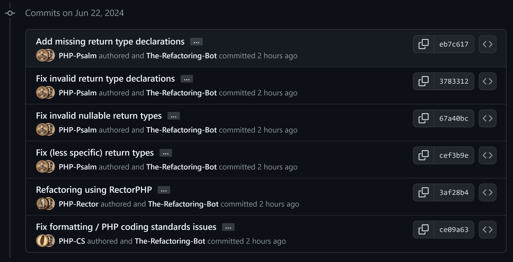

## Refactoring.bot

This bot is designed to perform static code analysis and provide code fixes through a new pull request when needed. It leverages various PHP developer tools like PHPStan, Psalm, and PHP CS Fixer to analyze and improve the quality of your codebase automatically. The script is configurable with GitHub Actions and checks for issues like coding standard violations, potential bugs, redundant code, and more. It even includes steps to install these developer tools if they are not already present on the environment. All the changes made by the bot are auto-committed and a pull request is created for review, ensuring transparency and control over the refactoring process.

## Bots

* [@PHP-Psalm](https://github.com/php-psalm)
* [@PHP-Rector](https://github.com/php-rector)
* [@PHP-CS](https://github.com/php-cs)

## Demo

